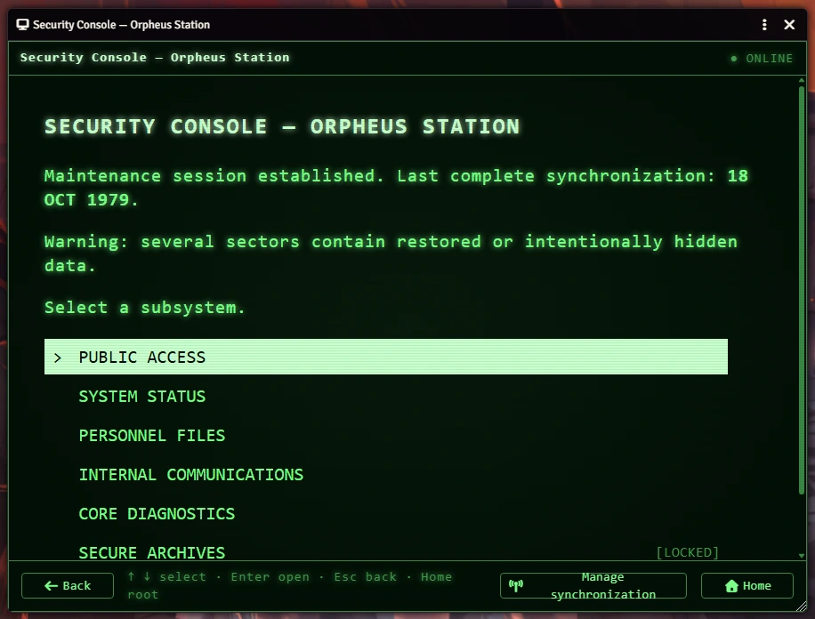
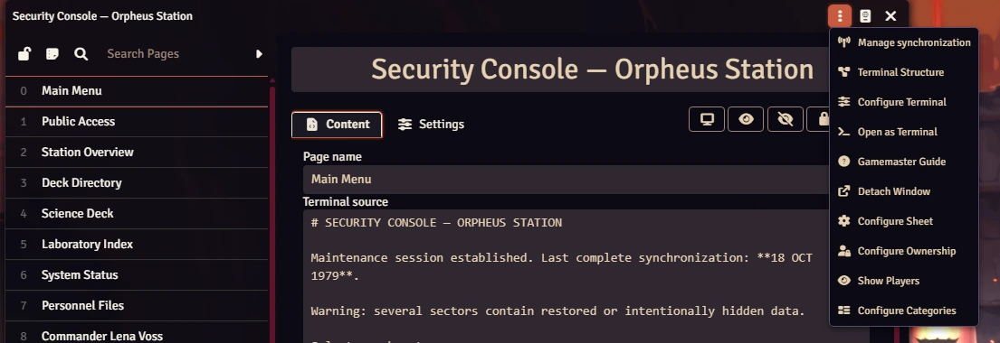
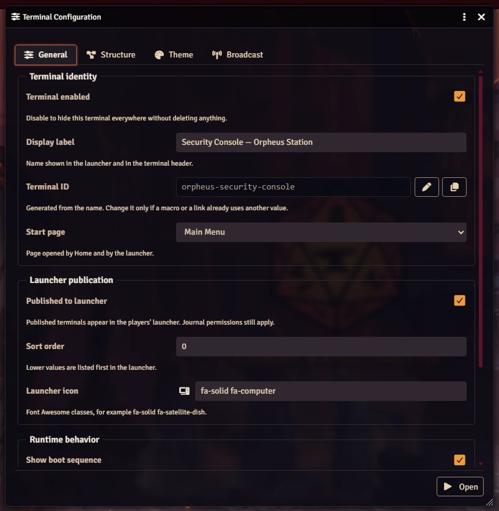
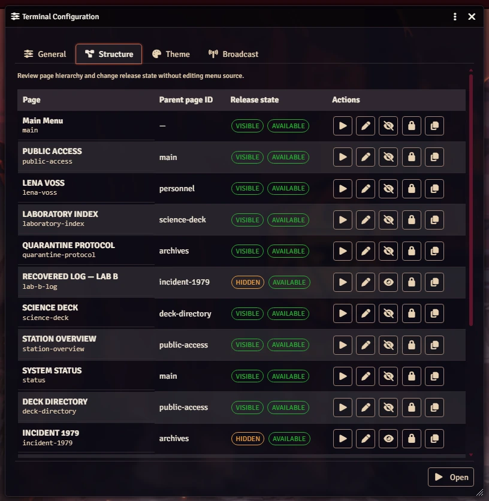
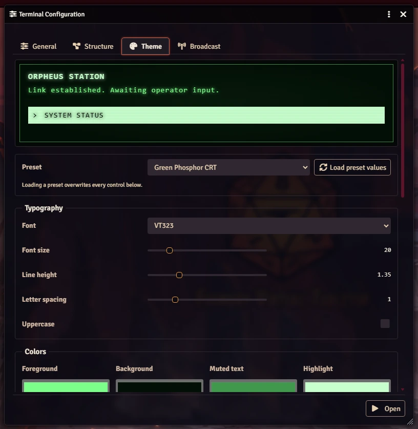
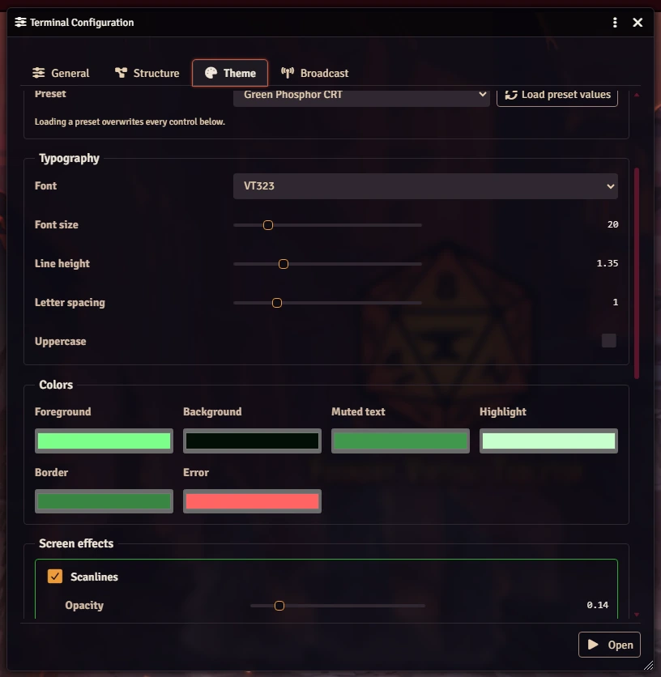
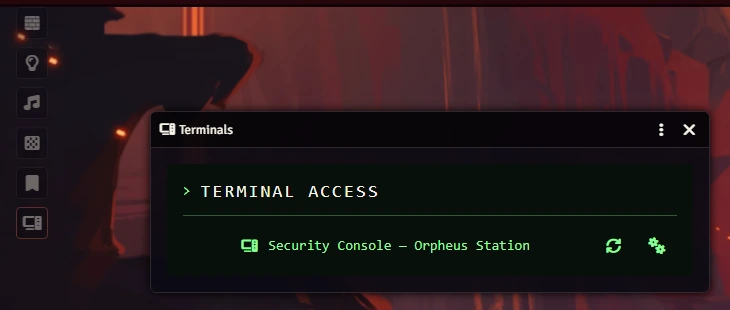
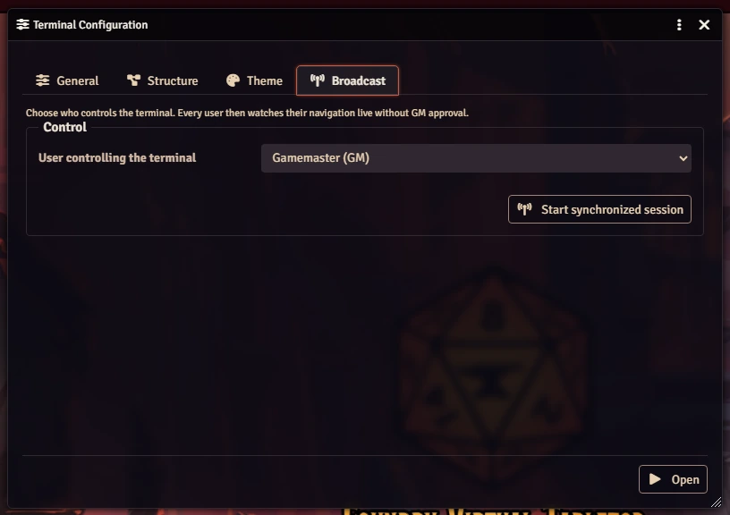
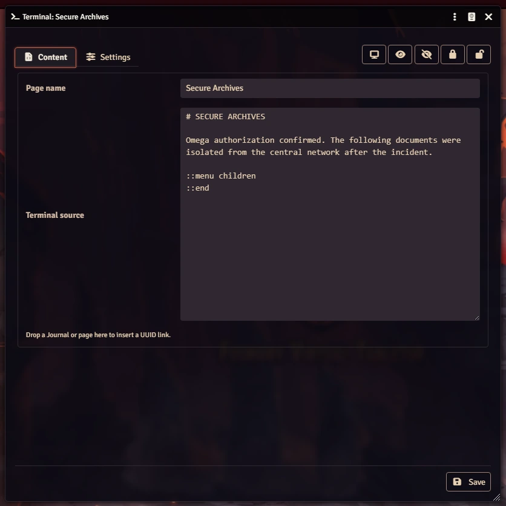
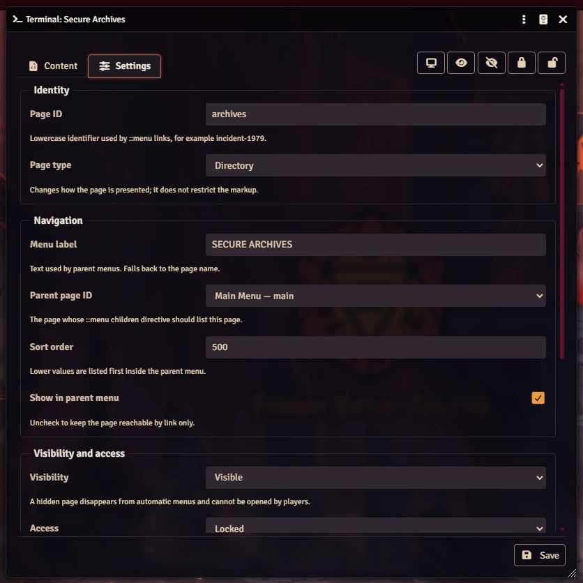

# Retro CRT Terminal

Retro CRT Terminal is a Foundry Virtual Tabletop v14 module for authoring fictional computer terminals as Journal Entry pages. It provides keyboard navigation, progressive disclosure, cross-Journal links, publication controls, and configurable CRT/VHS themes.



Terminal pages use a client-side typewriter effect by default. A click or any non-modifier key reveals the complete screen immediately. Each user can adjust the delay per character—or disable it with a value of `0`—from the module settings; disabling CRT/VHS effects also disables progressive typing.

## Installation

Requires Foundry VTT v14. In **Add-on Modules → Install Module**, paste the manifest URL, then enable **Retro CRT Terminal** in your world:

```
https://github.com/JDR-Ninja/fvtt-retro-crt-terminal/releases/latest/download/module.json
```

## Creating a terminal

1. Create a Journal Entry.
2. Add one or more pages using the **Terminal** page type.
3. Give every page a unique lowercase page ID such as `main` or `incident-1979`.
4. Set a child page's parent to the page ID that should list it.
5. Open the Journal header menu (the **⋮** button) and choose **Configure Terminal**. Every module action lives in that menu.

   

   One window holds four tabs: **General** for identity, publication, and runtime behavior, **Structure** for the page hierarchy and its release states, **Theme** for the CRT preset and its live preview, and **Broadcast** for synchronized viewing.
6. Use the **Structure** tab to reveal, hide, lock, or unlock prepared pages during play.

Configuration fields are generated from a DataModel schema, so every control validates its own value and the window saves as soon as a field changes — there is no Save button.



The **Structure** tab lists every page with its parent, its release state, and one-click actions to open, edit, reveal, hide, lock, unlock, or copy its UUID. Diagnostics for broken parents or malformed markup appear underneath.



The **Theme** tab repaints a live CRT preview as you drag each control, so a look can be dialled in without opening the terminal.



Colors are swatches and every screen effect is a card with its own sliders.



The **Terminals** Scene Control opens the player launcher. Publication controls whether a terminal appears there; Foundry Journal ownership still controls who may read it.



When a world has no terminal yet, the empty launcher offers GMs a **Create the example terminal** action. It creates and publishes a seventeen-page Orpheus mini-investigation with a fully public four-level drill-down branch, nested personnel files, communications, diagnostics, a password-protected archive, and two staged revelations. Existing generated demos expose an **Update the demo** action in the launcher so the scenario can be refreshed without replacing its Journal.

## Gamemaster Guide

The module includes a bilingual **Guides & Templates** Journal Compendium. A compact quick-start appears for GMs once per module version and can be disabled permanently. The question-mark controls in module windows and the Terminals Scene Control open the guide directly to the relevant section. The guide covers creation, page syntax, staged release, permissions, synchronized presentation, themes, a complete security-console example with copyable source, a pre-session checklist, and troubleshooting.

Ready-to-copy terminal Journals are grouped into **Français — Modèles** and **English — Templates** folders. Import a Journal into the world, rename it, assign a unique terminal ID, adjust its permissions, and publish it when it is ready for players. Templates are deliberately private and unpublished by default.

The separate **GM Macros** Compendium provides ready-to-import script macros in **Français — Macros** and **English — Macros** folders. Drag a macro to the hotbar, open its configuration, and edit the clearly marked constants at the beginning. Included recipes open a terminal, start or stop synchronized presentation, transfer control, and reveal or hide a prepared page.

## Synchronized viewing

A GM can select **Manage synchronization** from a Terminal window or Journal header. The GM chooses one connected controller. The terminal opens for every world user and then follows the controller directly:

- Arrow Up/Down synchronizes the selected menu row;
- navigation, Back, and Home synchronize the displayed page and history;
- session unlocks are shared;
- observers cannot interact with terminal controls;
- the GM can transfer control or stop the session at any time;
- if the controller disconnects, navigation freezes until the GM transfers control.



Only one synchronized terminal session is active per world. Foundry permissions are checked before the session starts and before the controller navigates to another page.

## Writing a page

A Terminal page sheet has two tabs. **Content** holds the page name and the markup source, with the editor at full height; drop a Journal or a page onto it to insert a link.



**Settings** holds everything else, grouped into Identity, Navigation, Visibility and access, and Presentation. The parent is picked from a list of the Journal's other pages rather than typed by hand, and every field carries a one-line explanation.



The toolbar buttons in the top right reveal, hide, lock, or unlock the page without leaving the sheet.

## Terminal markup

```md
# MAIN MENU

System online.

::menu children
::end
```

Explicit links use either a local page ID or a Foundry UUID. A bare UUID takes the target document's own name as its label, and Foundry's `{Label}` suffix overrides it:

```md
::menu
[PERSONNEL](terminal:personnel)
[ARCHIVE](@UUID[JournalEntry.abc.JournalEntryPage.def])
@UUID[JournalEntry.abc.JournalEntryPage.def]
@UUID[JournalEntry.abc.JournalEntryPage.def]{ARCHIVE}
::end
```

Supported markup includes headings, paragraphs, bold, italic, inline code, bullet lists, links, and these block directives:

```md
::menu children
::end

::menu
[LOCAL FILE](terminal:local-file)
[REMOTE FILE](@UUID[JournalEntry.abc.JournalEntryPage.def])
::end

::login
prompt: AUTHORIZATION CODE
success: terminal:classified
::end

::image
src: modules/example/assets/camera.webp
alt: CAMERA 04
::end

::effect glitch
SYSTEM INTEGRITY FAILURE
::end
```

Raw HTML, arbitrary CSS, remote assets, and executable JavaScript are not supported by terminal markup.

## Release states

Visibility and access are independent:

- hidden pages are omitted from player menus;
- visible and available pages open normally;
- visible and locked pages appear with a lock marker and require their configured lock flow.

Automatic child menus are resolved each time a page is displayed, so revealing a prepared child never requires editing its parent source.

These states only govern the terminal window: they are dramatic pacing, not a vault. A user with Observer permission on the Journal can still open the Journal itself from the sidebar and read every page, hidden or locked. Content that must stay secret until its reveal belongs in a separate Journal the players cannot observe, linked from the terminal by UUID.

## Public API

```js
const terminal = game.modules.get("retro-crt-terminal")?.api;

const app = await terminal.open("JournalEntry.example", {
  page: null,
  theme: null,
  fullscreen: false,
  rememberNavigation: false
});

await terminal.resolve("JournalEntry.example.JournalEntryPage.page");
await terminal.getTerminalConfig("JournalEntry.example");
await terminal.close(app.id);

// Shared-session management (GM)
await terminal.shared.start({
  terminalRootUuid: "JournalEntry.example",
  controllerUserId: game.user.id
});
await terminal.shared.update({ controllerUserId: "another-user" });
await terminal.shared.stop();
```

## Contributing

Development setup, checks, Compendium sources, screenshots, and the release process are described in [CONTRIBUTING.md](CONTRIBUTING.md).

## License

MIT. See [LICENSE](LICENSE).
